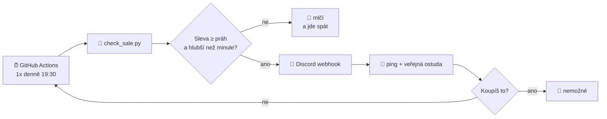

<h1 align="center">🐉 Hlídač slev na Baldur's Gate 3</h1>

  <em>Protože potřetí už to není náhoda, ale povahová vada.</em>

  
  
  
  

  

## 😔 Problém

Baldur's Gate 3 jde do slevy. Ty to zjistíš. Řekneš si *"jo, koupím to o víkendu"*.

Víkend proběhne. Sleva skončí. Hra není koupená.

**Třikrát po sobě.**

## 🤖 Řešení

Robot, který každých šest hodin zkontroluje cenu na Steamu, a jakmile spadne pod tvůj práh, napíše ti na Discord. S pingem. Veřejně. A počítá si, pokolikáté už to dělá — protože číslo `3` v embedu bolí víc než jakákoli výčitka.

Neběží na žádném serveru. Neplatíš za něj ani korunu. Je to cron v GitHub Actions a webhook. Nic víc.

## ✨ Co to umí

| | |
|---|---|
| 🕕 | Kontroluje cenu ráno i večer, napořád, zadarmo |
| 🎭 | Náhodné hlášky z osmi seznamů — neopakuje se ani po dvaceti slevách |
| 📈 | **Eskaluje.** První připomínka je milá. Čtvrtá ti počítá aura body do minusu |
| 🧠 | Pamatuje si, co už oznámil — nespamuje, ozve se jen když sleva klesne hlouběji |
| 🎨 | Barva embedu podle hloubky slevy (šedá → oranžová → červená → 🥇 zlatá) |
| 🧪 | Testovací režim, který se přizná, že je testovací |
| 🪶 | Nula závislostí. Jen standardní knihovna Pythonu |

## 🚀 Rozjezd (5 minut, fakt)

<b>1. Discord webhook</b>

V kanálu, kam to má chodit: **Nastavení kanálu → Integrace → Webhooky → Nový webhook**. Zkopíruj URL.

Žádná bot aplikace, žádný token, žádné intenty. Webhook je hloupá roura a přesně to tu stačí.

<b>2. Tvoje Discord ID</b>

V Discordu zapni **Nastavení → Pokročilé → Vývojářský režim**, pak pravý klik na sebe → **Kopírovat ID uživatele**.

Je to 18–19 číslic. Není to tvoje přezdívka. Ne, fakt není.

<b>3. Secrets v repozitáři</b>

**Settings → Secrets and variables → Actions → New repository secret**:

| Secret | Co to je |
|---|---|
| `DISCORD_WEBHOOK_URL` | URL z kroku 1 |
| `TARGET_USER_ID` | Číslo z kroku 2 |

Pozor na mezeru nebo enter na konci při vkládání. Pak `urlopen` spadne a ty budeš hodinu hledat proč.

<b>4. Zkušební výstřel</b>

Záložka **Actions → BG3 sale watch → Run workflow**, zaškrtni `force` a spusť.

Přijde ti zpráva s aktuální (nejspíš nulovou) slevou. Tím máš ověřený webhook, ping i embed najednou. Vynucený běh se **nepočítá** do počítadla připomínek, takže si testem nespálíš tu ostřejší hlášku.

## 🎛️ Nastavení

Vše se ladí v `env:` bloku ve `.github/workflows/sale-watch.yml`:

| Proměnná | Výchozí | K čemu |
|---|---|---|
| `STEAM_APP_ID` | `1086940` | AppID hry. BG3. Klidně si tam dej cokoli jiného |
| `STEAM_CC` | `cz` | Region pro ceny |
| `MIN_DISCOUNT` | `20` | Od kolika procent má vůbec otravovat |
| `FORCE_NOTIFY` | `false` | Pošli to bez ohledu na slevu (jen testy) |

> [!TIP]
> Larian slevuje zřídka a mělce. S prahem `20` se můžeš načekat opravdu dlouho — `10` je realističtější.

> [!NOTE]
> Cron je v **UTC**, GitHub jiné pásmo neumí — v zimě ti tedy časy o hodinu poskočí.
>
> | Cron | Léto (SELČ) | Zima (SEČ) | Proč |
> |---|---|---|---|
> | `30 18 * * *` | 20:30 | 19:30 | Steam spouští slevy kolem 19:00 |

## 🎪 Kde bydlí vtipy

Všechny hlášky jsou nahoře v `check_sale.py` v seznamech `HOOKS`, `NARRATION`, `SHAME`, `SHAME_MANY`, `DEEP_CUT`, `CTA`, `FOOTERS` a `AUTHORS`.

Přidat vlastní = dopsat řádek do seznamu. Logiky se to nedotkne. Bav se.

## ❓ FAQ

<b>Proč to neběží jako normální bot 24/7?</b>

Protože dělá **dva HTTP requesty denně**. Držet kvůli tomu naživu proces je jako topit v paneláku krbem.

Navíc v roce 2026 free tiery pro always-on boty prakticky umřely — Fly.io free tier zrušil, Render free služby usínají po 15 minutách a background workery má placené, Railway dává jen kredit. Oracle Always Free funguje, ale sbírá idle instance. Cron v Actions žádný z těchto problémů nemá.

<b>Nevypne GitHub naplánovaný workflow po 60 dnech nečinnosti?</b>

Vypnul by. Proto skript při každém běhu zapíše čerstvý `last_check` do `state.json` a workflow ho commitne zpátky. Repozitář je tím pádem pořád "aktivní" a plánovač běží dál.

Cenou jsou dva mikro-commity denně v historii. V privátním repu to nikoho netrápí.

<b>Kolik to žere minut?</b>

Veřejný repo: nic, Actions jsou zdarma neomezeně. Privátní: ~1 minuta za běh, při dvou denních spuštěních tedy asi **60 z 2000** měsíčních minut zdarma.

<b>Přišla mi zpráva, ale ping nikoho neoznačil.</b>

`TARGET_USER_ID` není číselné ID. Viz krok 2.

<b>Můžu tím hlídat jinou hru?</b>

Jasně, přepiš `STEAM_APP_ID`. AppID najdeš v URL obchodu: `store.steampowered.com/app/`**`1086940`**`/...`

Hlášky ale mluví o tom, že jsi to zapomněl koupit potřetí. Tak si je uprav, ať to sedí.

## 🗺️ Roadmap

- [x] Zjistit, že je sleva
- [x] Napsat na Discord
- [x] Počítat, kolikrát jsem to ignoroval
- [x] Urážet přímo úměrně tomu číslu
- [ ] Hlídat i GOG (přes IsThereAnyDeal)
- [ ] **Skutečně tu hru koupit** ← jediná položka, na které záleží
- [ ] Zahrát si ji

  Postaveno proti vlastní vůli · MIT licence · hru jsem pořád nekoupil

